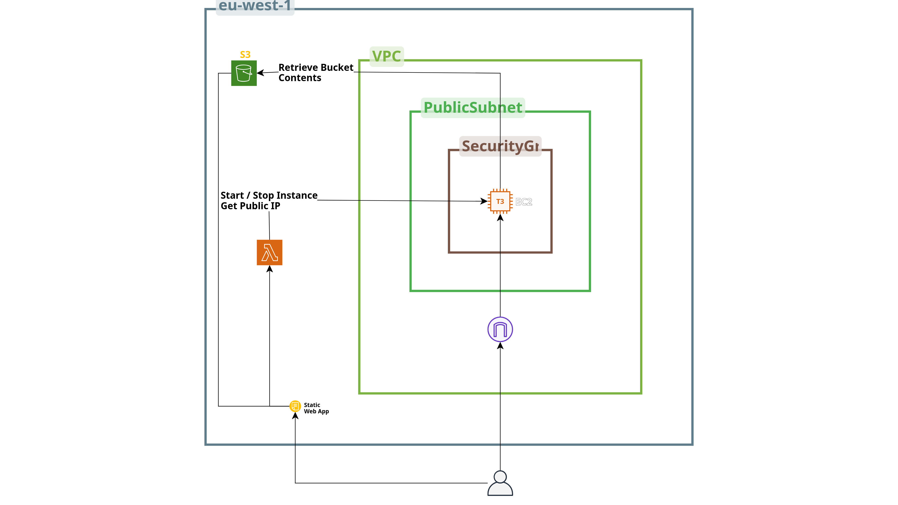
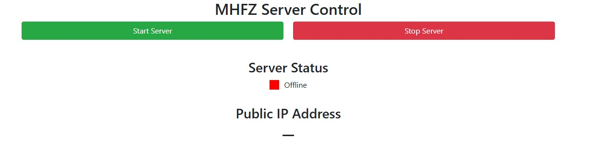

<!-- ABOUT THE PROJECT -->
## About The Project

This repository provides an easy-to-use template and framework for deploying Erupe, an open-source server emulator for Monster Hunter Frontier, on AWS in a single deployment. It also includes an optional serverless web app for controlling the server.

### Architecture


<p align="right">(<a href="#readme-top">back to top</a>)</p>

<!-- GETTING STARTED -->
## Getting Started

You need an AWS account with billing information configured. While cost minimization is one of the goals of this deployment, it will still incur AWS charges, primarily for the time the EC2 instance is running.

### Prerequisites

An S3 bucket containing the server binaries must be created before deploying the infrastructure. After configuring your desired AWS region, you can create the bucket using the following AWS CLI command, replacing `YOUR-BUCKET-NAME` with your desired bucket name:
  ```sh
  aws s3 mb s3://YOUR-BUCKET-NAME --region $(aws configure get region)
  ```
Before uploading the archive, rename it to `MHFZbinaries.7z`.

The chosen bucket name must match the `MhfzDataBucketName` parameter provided when deploying the CloudFormation stack.


Your current bucket structure should look like this:
  ```text
  YOUR-BUCKET-NAME/
  └── MHFZbinaries.7z
  ```

You should also create an **EC2 key pair** in AWS so you can access the EC2 instance via SSH for troubleshooting or updating the server configuration file.

Create a key pair using the following command, replacing `YOUR-KEY-NAME` with your desired key pair name:
  ```sh
  aws ec2 create-key-pair \ 
    --key-name YOUR-KEY-NAME \
    --query 'KeyMaterial' \
    --output text \
    --region $(aws configure get region) \
    > YOUR-KEY-NAME.pem
  ```
You need to download the private key afterwards from the **CloudShell** environment.
<p align="right">(<a href="#readme-top">back to top</a>)</p>

<!-- USAGE EXAMPLES -->
## Usage

Navigate to **CloudFormation** and create a new stack using the `server_deployment/deployment.yaml` template. Make sure to deploy the stack in the **same AWS Region as your previously created S3 bucket**.

When making updates to the `config.json` for the Server make sure that the first key is always `"Host"`.

__Optional__

You can optionally deploy the `server_control/serverless.yml` template as a separate stack. This deploys a serverless web application for starting and stopping the server, helping reduce costs by keeping the EC2 instance running only when needed. The application is accessible through the **S3 static website URL**.



To deploy the serverless web app:
1. Deploy a separate CloudFormation stack using `server_control/serverless.yml` in the same AWS Region as your server.
2. Download the contents of `server_control/serverless_frontend` from this repository.
3. Copy the URL from the stack's **Outputs** and replace `YOUR-LAMBDA-URL` in `serverless.js` with the provided URL.
4. Upload the contents of the serverless_frontend folder to the same S3 bucket specified in the prerequisites.
5. Make sure **Static website hosting** is enabled for the S3 bucket.
Your final bucket structure should look like this:
  ```text
  YOUR-BUCKET-NAME/
  └── MHFZbinaries.7z
  └── index.html
  └── main.css
  └── serverless.js
  ```

<!--_For more examples, please refer to the [Documentation](https://example.com)_-->

<p align="right">(<a href="#readme-top">back to top</a>)</p>

<!-- ACKNOWLEDGMENTS -->
## Acknowledgments

* [Serverless Webapp Template and Instructions](https://github.com/acantril/learn-cantrill-io-labs/tree/master/aws-serverless-pet-cuddle-o-tron)
* [GitHub README Template](https://github.com/othneildrew/Best-README-Template)
* [Erupe Server Emulator Project](https://github.com/Mezeporta/Erupe/tree/531b3d2fa6af9b102f775d1630360605abc0ac67)
* [Infrastructure Diagram made with Cloudcraft](https://www.cloudcraft.co/)
<p align="right">(<a href="#readme-top">back to top</a>)</p>